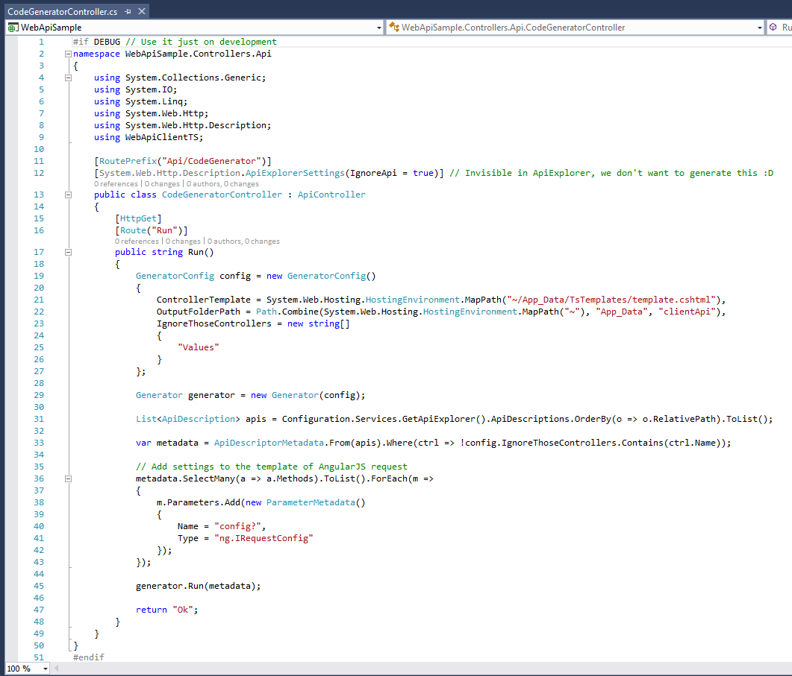
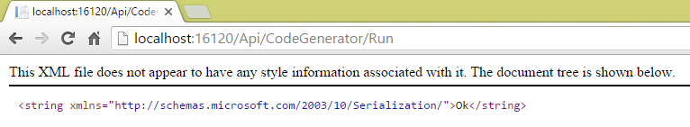
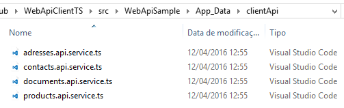

# WebApiClientTS
Asp.NET Web API client generator for TypeScript files  
  
This tool help you generating the complete client api in typescript to consume an web api made in .net  
It's generate the interface, class and all types needed.  
  
The generate is based on a template mode, wich read the api (.net) and generate the client api in typescript with a template using the razor engine.  
  
## Usage  
  
First you need to install the nuget package, you can do it with that command:  
```
Install-Package WebApiClientTS
```
  
Them you need to implement an specific controller in your api to explore your api and generate the client api when you call that.  
  
  
You need to indicate an **.cshtml** template to the generator, use it like line 21.  
  
Now you can run the web api and them acess the controller to generate the typescript client api.  

  
It's done, the typescript client api was generated  
  

Danke  

[WebApiClientTS on nuget.org](https://www.nuget.org/packages/WebApiClientTS/)
