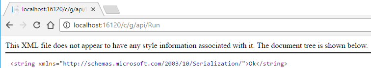
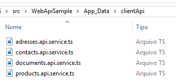

[](https://www.paypal.com/cgi-bin/webscr?cmd=_s-xclick&hosted_button_id=RW6F5XUSMW5NJ)

# WebApiClientTS
Asp.NET Web API client generator for TypeScript files  
  
This tool helps you generating the complete client API in TypeScript to consume a Web API made in .NET . It generates interfaces for all the types exposed by the API and classes to request each controller.
 
The generation is based on the ASP.NET ApiExplorer class. wich defines metadata for all the controllers exposed. This metadata is fed on a template (using the RazorEngine), wich generates the client API files in TypeScript.
  
## Usage  
  
First, you need to install the NuGet package, you can do it with that command:  
```
Install-Package WebApiClientTS
```
  
### There is two way to use it  

### First way

This is the old way, at this mode you need to explicit create a controller in your application.
Them you need to implement a specific controller in your API to explore your API and generate the client API when you call that.  
```csharp
#if DEBUG // Use it just on development
namespace WebApiSample.Controllers.Api
{
    using System;
    using System.Collections.Generic;
    using System.IO;
    using System.Linq;
    using System.Web.Http;
    using System.Web.Http.Description;
    using WebApiClientTS;

    [RoutePrefix("Api/CodeGenerator")]
    [System.Web.Http.Description.ApiExplorerSettings(IgnoreApi = true)] // Invisible in ApiExplorer, we don't want to generate this :D
    public class CodeGeneratorController : ApiController
    {
        [HttpGet]
        [Route("Run")]
        public string Run()
        {
            GeneratorConfig config = new GeneratorConfig()
            {
                ControllerTemplate = System.Web.Hosting.HostingEnvironment.MapPath("~/App_Data/TsTemplates/template.cshtml"),
                OutputFolderPath = Path.Combine(System.Web.Hosting.HostingEnvironment.MapPath("~"), "App_Data", "clientApi"),
                IgnoreThoseControllers = new string[]
                {
                    "Values"
                }
            };

            Generator generator = new Generator(config);

            List<ApiDescription> apis = Configuration.Services.GetApiExplorer().ApiDescriptions.OrderBy(o => o.RelativePath)
                .Where(w => !config.IgnoreThoseControllers.Contains(w.ActionDescriptor.ControllerDescriptor.ControllerName))
                .ToList();

            // Sample of an stringify function
            Func<string, string> stringifyFunction = (parameterName) => $"JSON.stringify({parameterName})";
            //Func<string, string> stringifyFunction = (parameterName) => $"\"'\"+{parameterName}+\"'\"";

            var metadata = ApiDescriptorMetadata.From(apis, stringifyFunction).Where(ctrl => !config.IgnoreThoseControllers.Contains(ctrl.Name));

            // Add settings to the template of AngularJS request
            metadata.SelectMany(a => a.Methods).ToList().ForEach(m =>
            {
                m.Parameters.Add(new ParameterMetadata()
                {
                    Name = "config?",
                    Type = "ng.IRequestConfig"
                });
            });

            generator.Run(metadata);

            return "Ok";
        }
    }
}
#endif
```    
  
You need to indicate a **.cshtml** template to the generator, use it like line 22.  
  
Now you can run the web API and then access the controller to generate the typescript client API.  

  
It's done, the typescript client api was generated  
  

### Second way  
At this way you don't need to create a new controller in you application, you just need to configure the generator (at `Global.asax`) and call the implicit contoller.  

```csharp
#if DEBUG // Use it just on development

            // The endpoint will be http://localhost:16120/c/g/api/run

            WebApiClientTS.GeneratorConfig config = new GeneratorConfig()
            {
                ControllerTemplate = System.Web.Hosting.HostingEnvironment.MapPath("~/App_Data/TsTemplates/template.cshtml"),
                OutputFolderPath = Path.Combine(System.Web.Hosting.HostingEnvironment.MapPath("~"), "App_Data", "clientApi"),
                IgnoreThoseControllers = new string[]
                {
                    "Values"
                }
            };
            
            WebApiClientTS.Generator.ConfigureApiGenerator(GlobalConfiguration.Configuration.Routes, config);
#endif
```
To call the controller  
  

It's done, at the same way the typescript client api was generated  
  

## How to create a package  

To create the package you just need to build the solution in `Release mode` and the package file will be created.

Or... 
  
You will need the *NuGet command line tool* then visit this [NuGet](https://docs.nuget.org/consume/command-line-reference) link to obtain and install this tool.  
  
Do not forget to build the project `Release mode` before generate the package ;D  
  
With NuGet installed, on `\src\NuGetPkg` folder of this repository, execute the following command to generate the package: `nuget.exe pack Package.nuspec`, it's done, the `.nupkg` was created at the same folder.  

Danke  

[WebApiClientTS on nuget.org](https://www.nuget.org/packages/WebApiClientTS/)
